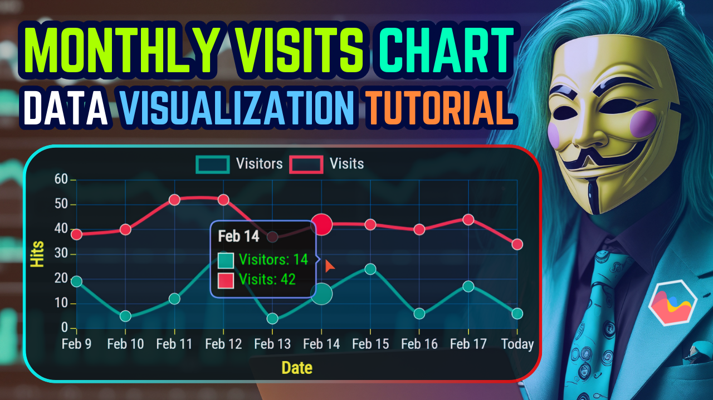
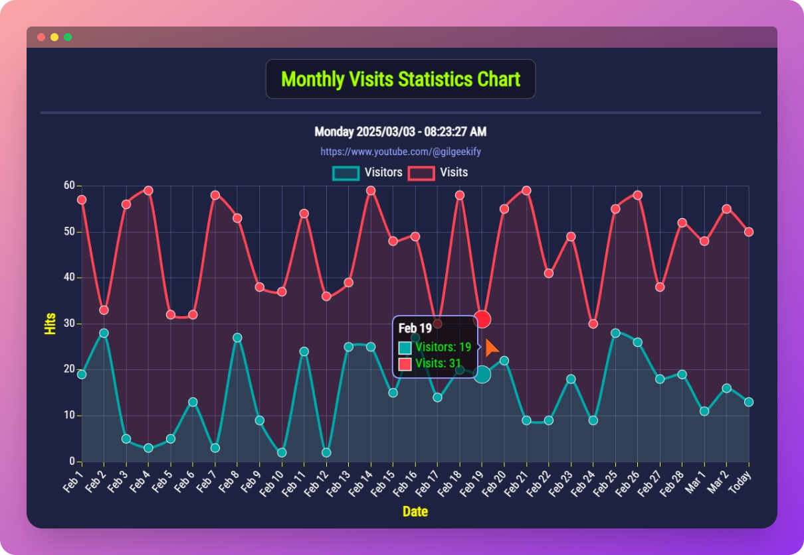

# ✅ Chart.js Monthly Visits Statistics Chart Tutorial

_Chart.js Tutorial: Design a Monthly Visits Stats Chart from Scratch!_

Learn to build a Monthly Visits Statistics Chart from scratch with Chart.js, the go-to JavaScript library for stunning, interactive charts! Perfect for tracking website traffic in your admin panel, this tutorial shows you how to create a customizable chart displaying monthly or weekly visits. Optimized for dark mode and starting with random data, you’ll also discover how to connect it to real data via a JSON API. Master data visualization and level up your web dev skills—watch now!

# 🎥 Tutorial Video
🔗 ***[https://youtu.be/AuJW8s172bA](https://youtu.be/AuJW8s172bA)*** | *Step-by-step guide*

# 🔴 Chart Live Demo
🔗 ***[https://saeedkohansal.github.io/Chart.js-Monthly-Visits-Statistics-Chart-Tutorial/source-code/](https://saeedkohansal.github.io/Chart.js-Monthly-Visits-Statistics-Chart-Tutorial/source-code/)***

<h1>📈 Monthly Visits Statistics Chart 📉</h1>

## If you enjoy my content, please consider supporting me! 😍🙏

**💙 PAYPAL DONATION**

https://paypal.me/gilgeekify

**❤️ PATREON**

https://www.patreon.com/gilgeekify

**💛 BUY ME A COFFEE**

https://www.buymeacoffee.com/gilgeekify

**🪙 My Public Address To Receive BTC • Bitcoin**

bc1qerc5ev074cqknu9nz589w4vjf5ecmhuc2df83h

**🥈 My Public Address To Receive ETH • Ethereum**

0x566A47B9731209A5144336D274D44224bfb9C0ea
